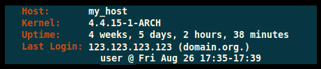

# motd.sh
Simple ssh greeter

Displays a customizable infobox.

#Installation
Copy the file motd.sh (with a +x flag) to /etc/profile.d

You may also want to change the value of PrintLastLog from "Yes" to "No" in /etc/ssh/sshd_config since the greeter displays last login information.
